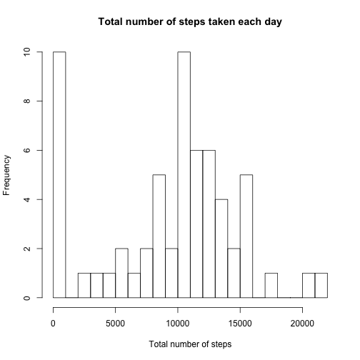
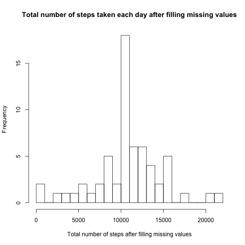

## Loading and preprocessing the data


```r
## Load data from the activity.zip file by first unzip and use read.csv to load into dataframe - data

unzip("activity.zip")
data <- read.csv("activity.csv")
str(data)
```

```
## 'data.frame':	17568 obs. of  3 variables:
##  $ steps   : int  NA NA NA NA NA NA NA NA NA NA ...
##  $ date    : Factor w/ 61 levels "2012-10-01","2012-10-02",..: 1 1 1 1 1 1 1 1 1 1 ...
##  $ interval: int  0 5 10 15 20 25 30 35 40 45 ...
```

```r
head(data)
```

```
##   steps       date interval
## 1    NA 2012-10-01        0
## 2    NA 2012-10-01        5
## 3    NA 2012-10-01       10
## 4    NA 2012-10-01       15
## 5    NA 2012-10-01       20
## 6    NA 2012-10-01       25
```

## What is mean total number of steps taken per day?


### 1. Make a histogram of the total number of steps taken each day

```r
##using dplyr package, summarizing the dataframe by date and sum of steps
##If the histogram doesn't show up here, please refer to the locaiton : figure/unnamed-chunk-3-1.png 
dataHist <- data %>% group_by(date) %>% summarize(StepsTotalPerDay = sum(steps, na.rm=T))
hist(dataHist$StepsTotalPerDay, 
     breaks=20,
     xlab='Total number of steps',
     main="Total number of steps taken each day")
```

 

### 2. Calculate and report the mean and median total number of steps taken per day

```r
## mean of the steps total per day
mean(dataHist$StepsTotalPerDay)
```

```
## [1] 9354.23
```

```r
## median of the steps total per day
median(dataHist$StepsTotalPerDay)
```

```
## [1] 10395
```

```r
summary(dataHist)
```

```
##          date    StepsTotalPerDay
##  2012-10-01: 1   Min.   :    0   
##  2012-10-02: 1   1st Qu.: 6778   
##  2012-10-03: 1   Median :10395   
##  2012-10-04: 1   Mean   : 9354   
##  2012-10-05: 1   3rd Qu.:12811   
##  2012-10-06: 1   Max.   :21194   
##  (Other)   :55
```

## What is the average daily activity pattern?
### 1. Make a time series plot (i.e. type = "l") of the 5-minute interval (x-axis) and the average number of steps taken, averaged across all days (y-axis)

```r
##using dplyr package, grouping the data by interval to get mean of steps averaged across all days, removing NA's

data2 <- data %>% group_by(interval) %>% summarize(AverageStepsPerInterval = mean(steps, na.rm=T))

##plot average number of steps by the interval from above data2 using plot type 'l'
##If the histogram doesn't show up here, please refer to the locaiton : figure/unnamed-chunk-5-1.png 
with(data2, {
        plot(interval, 
             AverageStepsPerInterval, 
             type='l',
             xlab = '5-minute interval',
             ylab = 'Average number of steps',
             main='Daily activity pattern')}
        )
```

 

### 2. Which 5-minute interval, on average across all the days in the dataset, contains the maximum number of steps?


```r
##using which.max to find maximum number of steps 
data2[which.max(data2$AverageStepsPerInterval),]
```

```
## Source: local data frame [1 x 2]
## 
##   interval AverageStepsPerInterval
## 1      835                206.1698
```

## Imputing missing values
### 1. Calculate and report the total number of missing values in the dataset (i.e. the total number of rows with NAs)


```r
##sum of all occurences with missing steps values
sum(is.na(data$steps))
```

```
## [1] 2304
```

### 2. Devise a strategy for filling in all of the missing values in the dataset. The strategy does not need to be sophisticated. For example, you could use the mean/median for that day, or the mean for that 5-minute interval, etc.


```r
##merging original data and data2 (with average steps per interval data) by the interval column
data3 <- merge(data, data2, by.x= "interval", by.y="interval")
head(data3)
```

```
##   interval steps       date AverageStepsPerInterval
## 1        0    NA 2012-10-01                1.716981
## 2        0     0 2012-11-23                1.716981
## 3        0     0 2012-10-28                1.716981
## 4        0     0 2012-11-06                1.716981
## 5        0     0 2012-11-24                1.716981
## 6        0     0 2012-11-15                1.716981
```

### 3. Create a new dataset that is equal to the original dataset but with the missing data filled in.

```r
## steps column(#3rd index) with NA values gets replaced with the value of AverageStepsPerInterval (#4th index)
##Filling missing values with the mean of the average steps per each interval across all days as calculated in previous question.
data3[is.na(data3$steps),2] <- data3[is.na(data3$steps),4]
```

### 4. Make a histogram of the total number of steps taken each day and Calculate and report the mean and median total number of steps taken per day. Do these values differ from the estimates from the first part of the assignment? What is the impact of imputing missing data on the estimates of the total daily number of steps?

```r
##using dplyr package summarizing the data3 with filled in missing values by date and sum of steps

dataHist2 <- data3 %>% group_by(date) %>% summarize(StepsTotalPerDay2 = sum(steps, na.rm=T))
## generate histogram of the steps total per day
##If the histogram doesn't show up here, please refer to the locaiton : figure/unnamed-chunk-10-1.png 
hist(dataHist2$StepsTotalPerDay2, 
     breaks=20,
     xlab='Total number of steps after filling missing values',
     main="Total number of steps taken each day after filling missing values")
```

 

```r
##mean of the steps from above data set
mean(dataHist2$StepsTotalPerDay2)
```

```
## [1] 10766.19
```

```r
##median of the steps from above data set
median(dataHist2$StepsTotalPerDay2)
```

```
## [1] 10766.19
```

```r
summary(dataHist2)
```

```
##          date    StepsTotalPerDay2
##  2012-10-01: 1   Min.   :   41    
##  2012-10-02: 1   1st Qu.: 9819    
##  2012-10-03: 1   Median :10766    
##  2012-10-04: 1   Mean   :10766    
##  2012-10-05: 1   3rd Qu.:12811    
##  2012-10-06: 1   Max.   :21194    
##  (Other)   :55
```
#### After filling the missing values with that of mean of the steps for that interval across all days, median and mean became same. Median moved closer to the Mean.

## Are there differences in activity patterns between weekdays and weekends?
### 1. Create a new factor variable in the dataset with two levels -- "weekday" and "weekend" indicating whether a given date is a weekday or weekend day.


```r
##add name of the day as a new column to the data3 (data set with missing values filled in)
data3$dayname = weekdays(as.Date(data3$date))
##function to categorize the day as weekend or weekday
daycategory <- function(x){
        
        if(x %in% c( 'Saturday', 'Sunday'))
                return( 'Weekend')
        else 
                return( 'Weekday')
}

data3$daycategory = as.factor(apply(as.matrix(data3$dayname), 1, daycategory))

head(data3)
```

```
##   interval    steps       date AverageStepsPerInterval  dayname
## 1        0 1.716981 2012-10-01                1.716981   Monday
## 2        0 0.000000 2012-11-23                1.716981   Friday
## 3        0 0.000000 2012-10-28                1.716981   Sunday
## 4        0 0.000000 2012-11-06                1.716981  Tuesday
## 5        0 0.000000 2012-11-24                1.716981 Saturday
## 6        0 0.000000 2012-11-15                1.716981 Thursday
##   daycategory
## 1     Weekday
## 2     Weekday
## 3     Weekend
## 4     Weekday
## 5     Weekend
## 6     Weekday
```

```r
str(data3)
```

```
## 'data.frame':	17568 obs. of  6 variables:
##  $ interval               : int  0 0 0 0 0 0 0 0 0 0 ...
##  $ steps                  : num  1.72 0 0 0 0 ...
##  $ date                   : Factor w/ 61 levels "2012-10-01","2012-10-02",..: 1 54 28 37 55 46 20 47 38 56 ...
##  $ AverageStepsPerInterval: num  1.72 1.72 1.72 1.72 1.72 ...
##  $ dayname                : chr  "Monday" "Friday" "Sunday" "Tuesday" ...
##  $ daycategory            : Factor w/ 2 levels "Weekday","Weekend": 1 1 2 1 2 1 2 1 1 2 ...
```

### 2. Make a panel plot containing a time series plot (i.e. type = "l") of the 5-minute interval (x-axis) and the average number of steps taken, averaged across all weekday days or weekend days (y-axis). The plot should look something like the following, which was created using simulated data:


```r
library(lattice)
##uisng the lattice package and xyplot function to plot the steps and interval by the daycategory (weekday/weekend) in single column and 2 rows layout
##If the histogram doesn't show up here, please refer to the locaiton : figure/unnamed-chunk-12-1.png 
xyplot(AverageStepsPerInterval ~ interval | daycategory, 
       data= data3,
       type='l',
       xlab='5-minute interval',
       ylab='Average number of steps across all days',
       layout=c(1,2))
```

 
